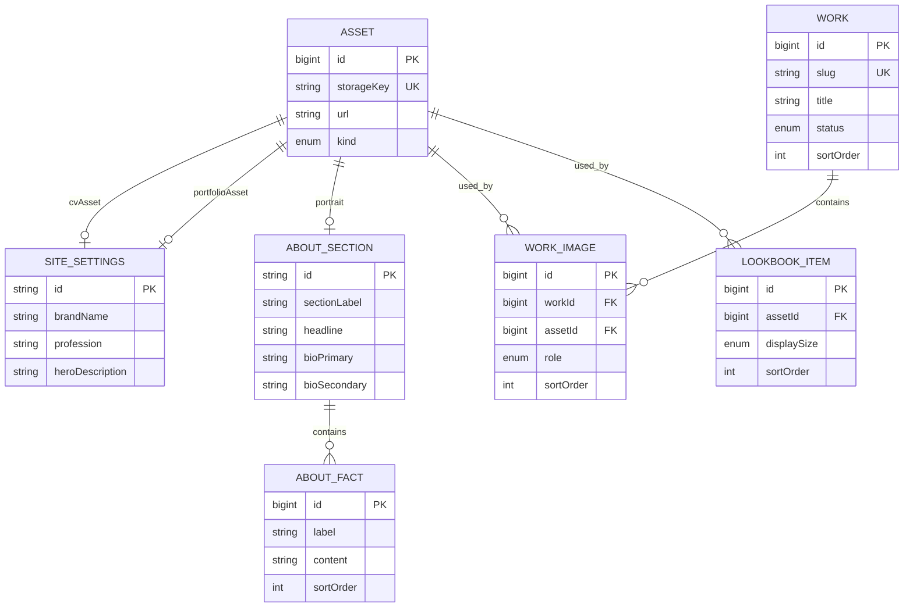

# Prisma Veri Modeli Mimarisi

Bu belge, Esra Kılıç portfolyo uygulamasının mevcut ziyaretçi sayfaları ve yönetim paneli incelenerek hazırlanmıştır. Amaç; arayüzdeki sabit içerikleri PostgreSQL üzerinde Prisma ile yönetilebilir, sıralanabilir ve genişletilebilir bir veri yapısına taşımaktır.

## 1. Projede görülen veri alanları

| Uygulama alanı | Kaynak dosyalar | Gereken veri |
| --- | --- | --- |
| Ana sayfa / genel bilgiler | `app/(root)/page.tsx` | Marka adı, meslek, hero açıklaması, CV ve portfolyo PDF'i |
| Hakkımda | `app/(admin)/admin/about/page.tsx` | Bölüm etiketi, portre, ana cümle, iki biyografi paragrafı, eğitim/uzmanlık/araçlar/diller |
| Seçilmiş işler | `app/(admin)/admin/works/page.tsx` | Ad, slug, kategori, yıl, malzeme, kısa açıklama, detay, parça sayısı, odak, yayın durumu ve sıra |
| İş detayı | `app/(root)/tasarimlar/[tasarimId]/page.tsx` | Koleksiyon bilgileri, kapak görseli ve sıralı galeri |
| Lookbook | `app/(admin)/admin/lookbook/page.tsx` | Sıralı görseller, görünürlük ve grid yerleşimi |
| İletişim | `app/(admin)/admin/contact/page.tsx` | Başlık, e-posta, Instagram ve LinkedIn bağlantıları |

## 2. Tasarım kararları

- Veritabanı PostgreSQL olarak kabul edilmiştir.
- İç kimlikler tek veritabanı için verimli olan sıralı `BigInt` anahtarlarla tutulur. Ziyaretçiye açık iş URL'lerinde kimlik yerine benzersiz `slug` kullanılır.
- PostgreSQL tablo ve kolon adları `@@map` / `@map` ile `snake_case` olarak üretilir; TypeScript tarafında okunabilir `camelCase` alanlar korunur.
- Görsel ve PDF bilgileri tek bir `Asset` modelinde tutulur. Dosyanın kendisi veritabanına yazılmaz; object storage/CDN adresi ve metadata saklanır.
- Bir iş silindiğinde ona ait `WorkImage` bağlantıları silinir (`Cascade`), fakat ortak medya kaydı otomatik silinmez. Böylece yanlışlıkla fiziksel dosya kaybı önlenir.
- Bağlı bir `Asset` silinemez (`Restrict`). Önce ilgili kullanım kaldırılmalı, sonra storage dosyası ve `Asset` kaydı kontrollü biçimde temizlenmelidir.
- `SiteSettings`, `AboutSection` ve `ContactInfo` tek satırlı içeriklerdir. Uygulama bu kayıtları sabit `id = "main"` anahtarıyla `upsert` etmelidir.
- Koleksiyon ve galeri sıraları benzersiz kısıtlarla korunur. Sıra değişikliği bir transaction içinde yapılmalıdır.
- Basit portfolyo ihtiyacı için soft delete eklenmemiştir. Geri dönüşüm kutusu istenirse daha sonra `deletedAt` ve kısmi indeks içeren ayrı bir sürüm planlanmalıdır.

## 3. İlişki diyagramı



## 4. Önerilen Prisma modelleri

Aşağıdaki blok, Prisma'nın klasik PSL model sözdizimiyle `schema.prisma` içine taşınabilir. Yalnızca veri modeli gösterilmiştir; kurulum sürümüne göre generator ve bağlantı ayarı ayrıca eklenmelidir.

```prisma
datasource db {
  provider = "postgresql"
}

enum AssetKind {
  IMAGE
  DOCUMENT

  @@map("asset_kind")
}

enum PublicationStatus {
  DRAFT
  PUBLISHED
  ARCHIVED

  @@map("publication_status")
}

enum WorkImageRole {
  COVER
  GALLERY

  @@map("work_image_role")
}

enum LookbookDisplaySize {
  PORTRAIT
  LANDSCAPE_WIDE

  @@map("lookbook_display_size")
}

model Asset {
  id         BigInt    @id @default(autoincrement()) @db.BigInt
  kind       AssetKind @default(IMAGE)
  storageKey String    @unique @map("storage_key")
  url        String
  fileName   String    @map("file_name")
  mimeType   String    @map("mime_type")
  altText    String?   @map("alt_text")
  width      Int?
  height     Int?
  sizeBytes  BigInt?   @map("size_bytes") @db.BigInt
  blurDataUrl String?  @map("blur_data_url")
  createdAt  DateTime  @default(now()) @map("created_at") @db.Timestamptz(3)
  updatedAt  DateTime  @updatedAt @map("updated_at") @db.Timestamptz(3)

  portraitFor      AboutSection[] @relation("AboutPortrait")
  cvFor            SiteSettings[] @relation("CvAsset")
  portfolioFileFor SiteSettings[] @relation("PortfolioAsset")
  workImages       WorkImage[]
  lookbookItems    LookbookItem[]

  @@index([kind])
  @@map("assets")
}

model SiteSettings {
  id              String   @id @default("main")
  brandName       String   @map("brand_name")
  profession      String
  heroDescription String   @map("hero_description")
  cvAssetId       BigInt?  @map("cv_asset_id") @db.BigInt
  portfolioAssetId BigInt? @map("portfolio_asset_id") @db.BigInt
  createdAt       DateTime @default(now()) @map("created_at") @db.Timestamptz(3)
  updatedAt       DateTime @updatedAt @map("updated_at") @db.Timestamptz(3)

  cvAsset        Asset? @relation("CvAsset", fields: [cvAssetId], references: [id], onDelete: Restrict)
  portfolioAsset Asset? @relation("PortfolioAsset", fields: [portfolioAssetId], references: [id], onDelete: Restrict)

  @@index([cvAssetId])
  @@index([portfolioAssetId])
  @@map("site_settings")
}

model AboutSection {
  id             String   @id @default("main")
  sectionLabel   String   @map("section_label")
  headline       String
  bioPrimary     String   @map("bio_primary")
  bioSecondary   String   @map("bio_secondary")
  portraitYear   Int?     @map("portrait_year") @db.SmallInt
  portraitAssetId BigInt? @map("portrait_asset_id") @db.BigInt
  createdAt      DateTime @default(now()) @map("created_at") @db.Timestamptz(3)
  updatedAt      DateTime @updatedAt @map("updated_at") @db.Timestamptz(3)

  portrait Asset?      @relation("AboutPortrait", fields: [portraitAssetId], references: [id], onDelete: Restrict)
  facts    AboutFact[]

  @@index([portraitAssetId])
  @@map("about_sections")
}

model AboutFact {
  id        BigInt   @id @default(autoincrement()) @db.BigInt
  aboutId   String   @map("about_id")
  label     String
  content   String
  sortOrder Int      @map("sort_order") @db.SmallInt
  createdAt DateTime @default(now()) @map("created_at") @db.Timestamptz(3)
  updatedAt DateTime @updatedAt @map("updated_at") @db.Timestamptz(3)

  about AboutSection @relation(fields: [aboutId], references: [id], onDelete: Cascade)

  @@unique([aboutId, sortOrder])
  @@map("about_facts")
}

model Work {
  id          BigInt            @id @default(autoincrement()) @db.BigInt
  slug        String            @unique
  title       String
  category    String
  year        Int               @db.SmallInt
  material    String?
  summary     String
  description String
  pieceCount  Int?              @map("piece_count") @db.SmallInt
  focus       String?
  status      PublicationStatus @default(DRAFT)
  sortOrder   Int               @map("sort_order") @db.SmallInt
  publishedAt DateTime?         @map("published_at") @db.Timestamptz(3)
  createdAt   DateTime          @default(now()) @map("created_at") @db.Timestamptz(3)
  updatedAt   DateTime          @updatedAt @map("updated_at") @db.Timestamptz(3)

  images WorkImage[]

  @@unique([sortOrder])
  @@index([status, sortOrder, id])
  @@map("works")
}

model WorkImage {
  id        BigInt        @id @default(autoincrement()) @db.BigInt
  workId    BigInt        @map("work_id") @db.BigInt
  assetId   BigInt        @map("asset_id") @db.BigInt
  role      WorkImageRole @default(GALLERY)
  sortOrder Int           @map("sort_order") @db.SmallInt
  createdAt DateTime      @default(now()) @map("created_at") @db.Timestamptz(3)
  updatedAt DateTime      @updatedAt @map("updated_at") @db.Timestamptz(3)

  work  Work  @relation(fields: [workId], references: [id], onDelete: Cascade)
  asset Asset @relation(fields: [assetId], references: [id], onDelete: Restrict)

  @@unique([workId, sortOrder])
  @@unique([workId, assetId])
  @@index([assetId])
  @@index([workId, role])
  @@map("work_images")
}

model LookbookItem {
  id          BigInt              @id @default(autoincrement()) @db.BigInt
  assetId     BigInt              @map("asset_id") @db.BigInt
  displaySize LookbookDisplaySize @default(PORTRAIT) @map("display_size")
  sortOrder   Int                 @map("sort_order") @db.SmallInt
  isPublished Boolean             @default(true) @map("is_published")
  createdAt   DateTime            @default(now()) @map("created_at") @db.Timestamptz(3)
  updatedAt   DateTime            @updatedAt @map("updated_at") @db.Timestamptz(3)

  asset Asset @relation(fields: [assetId], references: [id], onDelete: Restrict)

  @@unique([sortOrder])
  @@index([assetId])
  @@index([isPublished, sortOrder, id])
  @@map("lookbook_items")
}

model ContactInfo {
  id           String   @id @default("main")
  sectionLabel String   @default("04 — İletişim") @map("section_label")
  title        String
  email        String
  instagramUrl String?  @map("instagram_url")
  linkedinUrl  String?  @map("linkedin_url")
  createdAt    DateTime @default(now()) @map("created_at") @db.Timestamptz(3)
  updatedAt    DateTime @updatedAt @map("updated_at") @db.Timestamptz(3)

  @@map("contact_info")
}
```

## 5. Model sorumlulukları ve kurallar

### `Asset`

- Cloudinary, S3 veya Supabase Storage gibi bir servisteki dosyanın kaydını temsil eder.
- `storageKey`, storage içindeki değişmeyen ve benzersiz anahtardır; `url` sunum adresidir.
- `width`, `height` ve `blurDataUrl`, Next.js görsel optimizasyonu ve layout shift azaltımı için kullanılır.
- `kind = DOCUMENT` olan kayıtlar CV/portfolyo PDF'i için; `IMAGE` kayıtları portre, iş ve lookbook için kullanılır.
- Bir görselin bağlama özel alternatif metni gerekirse `altText`, ileride `WorkImage` veya `LookbookItem` üzerine taşınabilir.

### `SiteSettings`, `AboutSection`, `ContactInfo`

- Her biri `main` anahtarlı tek kayıt olarak yönetilir.
- Form kaydetme işlemi `upsert({ where: { id: "main" }, ... })` kullanmalıdır.
- Eğitim, uzmanlık, araçlar ve diller sabit kolonlar yerine `AboutFact` satırlarıdır. Böylece yönetim panelinden yeni bir bilgi kartı eklenebilir ve sıra değiştirilebilir.

### `Work` ve `WorkImage`

- `/tasarimlar/[tasarimId]` rotasındaki `tasarimId`, veritabanında `Work.slug` ile eşleşmelidir.
- Slug küçük harfli, URL uyumlu ve benzersiz olmalıdır (ör. `kok`).
- Ziyaretçi listesi yalnızca `PUBLISHED` kayıtları `sortOrder ASC, id ASC` sırasıyla göstermelidir.
- `publishedAt`, durum ilk kez `PUBLISHED` olduğunda set edilmeli; taslağa dönüşte geçmiş yayın bilgisinin korunup korunmayacağı ürün kararı olarak belirlenmelidir.
- Her iş için uygulama seviyesinde tam bir `COVER` görseli bulunması doğrulanmalıdır. Prisma'nın standart indeksleri “iş başına yalnızca bir COVER” kuralını koşullu benzersiz indeksle ifade edemez; gerekirse migration SQL'ine şu indeks eklenebilir:

```sql
create unique index work_images_one_cover_per_work_idx
on work_images (work_id)
where role = 'COVER';
```

### `LookbookItem`

- `PORTRAIT` tek kolon, `LANDSCAPE_WIDE` iki kolon kaplayacak şekilde mevcut grid tasarımını karşılar.
- Yalnızca `isPublished = true` kayıtları `sortOrder ASC, id ASC` ile gösterilir.
- Görsel sıraları değiştirilirken geçici sıra çakışmalarını önlemek için transaction kullanılmalıdır.

## 6. Ekran-model eşlemesi

| Ekran | Okuma/yazma modeli |
| --- | --- |
| Ana sayfa hero ve dosya bağlantıları | `SiteSettings` + `Asset` |
| Hakkımda alanı | `AboutSection` + `AboutFact` + portre `Asset` |
| Ana sayfa seçilmiş işler | `Work` + `WorkImage(role = COVER)` + `Asset` |
| Tasarım detay sayfası | `Work` + sıralı `WorkImage` + `Asset` |
| Lookbook | `LookbookItem` + `Asset` |
| İletişim | `ContactInfo` |
| Admin genel bakış sayaçları | `Work.count` ve `LookbookItem.count` |

## 7. Önerilen sorgu biçimleri

Yayınlanmış işler:

```ts
const works = await prisma.work.findMany({
  where: { status: "PUBLISHED" },
  orderBy: [{ sortOrder: "asc" }, { id: "asc" }],
  include: {
    images: {
      where: { role: "COVER" },
      take: 1,
      include: { asset: true },
    },
  },
});
```

Slug ile iş detayı:

```ts
const work = await prisma.work.findUnique({
  where: { slug },
  include: {
    images: {
      orderBy: { sortOrder: "asc" },
      include: { asset: true },
    },
  },
});
```

Tekil hakkımda kaydını güncelleme:

```ts
await prisma.aboutSection.upsert({
  where: { id: "main" },
  create: { id: "main", ...data },
  update: data,
});
```

> `BigInt` değerleri JSON'a doğrudan çevrilemez. Server Component içinde sorun yoktur; API/Client Component sınırından geçirilecekse kimlikleri `String(id)` olarak serileştirin veya DTO katmanı kullanın.

## 8. Doğrulama kuralları

Prisma şemasının yanında form doğrulama katmanında şu kurallar uygulanmalıdır:

- `year`: makul bir aralıkta tam sayı (ör. 1900–2100).
- `pieceCount`: varsa sıfırdan büyük tam sayı.
- `sortOrder`: sıfır veya daha büyük tam sayı.
- `slug`: `^[a-z0-9]+(?:-[a-z0-9]+)*$` biçiminde.
- `email`: geçerli e-posta biçiminde.
- Instagram/LinkedIn ve medya adresleri: izin verilen `https` URL'leri.
- Görseller: izin verilen MIME türü ve dosya boyutu; PDF alanları yalnızca `application/pdf`.
- Yayına alınan iş: başlık, özet, detay ve en az bir kapak görseline sahip olmalı.

## 9. Uygulama sırası

1. Kullanılacak Prisma ana sürümünü seçin. Bu belge model katmanını hedefler; Prisma 7'de `schema.prisma`, Prisma 8'de sözleşme yaklaşımı ve `contract.prisma` kullanılır.
2. PostgreSQL bağlantısını ve Prisma istemcisini kurun.
3. Yukarıdaki modelleri şemaya ekleyip ilk migration'ı üretin.
4. `main` kayıtlarını ve mevcut örnek “Kök” koleksiyonunu seed edin.
5. Storage yükleme akışını kurup yüklenen dosyaları `Asset` olarak kaydedin.
6. Önce public sayfalardaki sabit verileri server-side Prisma sorgularına taşıyın.
7. Admin formlarını Server Action veya Route Handler üzerinden doğrulamalı mutation'lara bağlayın.
8. Admin rotalarını kimlik doğrulama ve yetkilendirme ile koruyun. Kimlik sağlayıcısı seçilmediği için kullanıcı/oturum modelleri bu belgeye bilinçli olarak eklenmemiştir.

## 10. Kapsam dışı ve sonraki kararlar

- Kimlik doğrulama sağlayıcısı ve admin kullanıcı modeli
- Kullanılacak dosya depolama servisi
- Çoklu dil desteği
- İçerik revizyon geçmişi / geri dönüşüm kutusu
- Görsel kırpma odak noktası ve gelişmiş responsive varyantlar
- Trafik analitiği ve iletişim formu mesajlarının saklanması

Bu ihtiyaçlar netleştiğinde mevcut modeller bozulmadan yeni tablolarla genişletilebilir.
